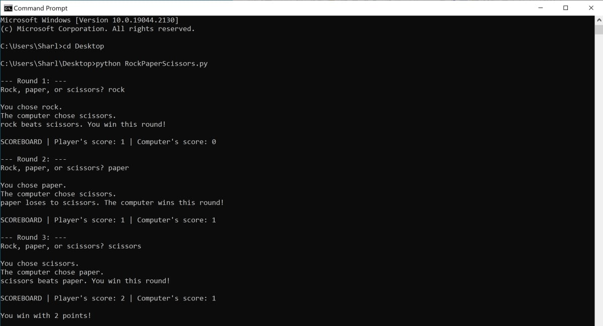

# python-rock-paper-scissors
Rock Paper Scissors tutorial in Python

This is a python tutorial to create a Rock, Paper, Scissors game.

You can play the game through a console. Type in your move, and then wait for the computer to enter their move. The game will determine who won after each round.

## Prerequisites 

* Make sure you have [Python](https://www.python.org/downloads/) on your computer. 

## To Run

* Open the command line or terminal, and navigate to the file where the python script is stored. For example: `cd C:\Users\Sharl\Desktop\python-rock-paper-scissors`
* Run the python command: `python RockPaperScissors.py`
* The Rock, Paper, Scissors game will start.

## Example

